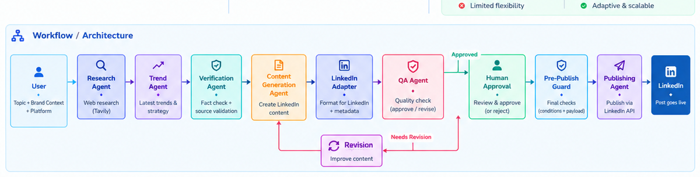

# SocialPilot AI

### Multi-Agent Social Media Management System

SocialPilot AI is an agentic AI system that automates the end-to-end workflow of researching a topic, verifying evidence, generating professional LinkedIn content, performing quality checks, getting human approval, and publishing the approved post through the LinkedIn API.

The project is designed to demonstrate how multiple specialized AI agents can collaborate through a stateful workflow instead of relying on a single LLM call.

---

## Why SocialPilot AI?

Creating high-quality social media content is not only a writing problem.

A reliable workflow needs to:

- Research current information
- Identify useful trends and signals
- Verify claims against source evidence
- Generate platform-specific content
- Check factual and formatting quality
- Revise content when QA fails
- Keep a human in the approval loop
- Run a final pre-publish safety check
- Publish through a real platform API

SocialPilot AI combines these steps into one orchestrated workflow.

---

## What Makes It Agentic?

This project is more than an LLM-powered content generator.

It uses multiple specialized agents, each responsible for a specific task:

| Agent | Responsibility |
|---|---|
| Research Agent | Searches the web and collects source evidence |
| Trend Agent | Detects repeated topics, keywords and trend signals |
| Verification Agent | Separates supported facts from uncertain claims |
| Content Generation Agent | Creates the initial educational post |
| LinkedIn Adapter | Formats content specifically for LinkedIn |
| QA Agent | Reviews factual accuracy, quality, language and formatting |
| Revision Agent | Improves content when QA identifies problems |
| Human Approval | Allows a human to approve or reject generated content |
| Pre-Publish Guard | Performs final publishing checks |
| Publishing Agent | Sends the approved payload to LinkedIn |

The agents share structured state through LangGraph, allowing the workflow to make decisions based on previous results.

---

## Workflow / Architecture



### Workflow Summary

```text
User Input
    ↓
Research Agent
    ↓
Trend Detection
    ↓
Verification Agent
    ↓
Content Generation
    ↓
LinkedIn Adapter
    ↓
QA Agent
    ↓
 ┌───────────────────────────────┐
 │ QA = NEEDS_REVISION           │
 │        ↓                      │
 │ Revision Agent → QA           │
 │        (max 1 revision)       │
 └───────────────────────────────┘
    ↓
Human Approval
    ├── Reject → Regenerate Content
    │             using existing research
    │             and verified facts
    │
    └── Approve
          ↓
    Pre-Publish Guard
          ↓
    Publishing Agent
          ↓
    LinkedIn API
          ↓
    Published Post
```

---

## End-to-End Flow

### 1. Research

The Research Agent uses web search to collect relevant sources for the requested topic.

The research output contains:

- Search query
- Source titles
- URLs
- Source content
- Research summary

The workflow keeps the source evidence available for later verification and QA.

### 2. Trend Detection

The Trend Agent analyzes the collected sources and identifies repeated signals such as:

- Topics
- Keywords
- Concepts
- Frequently mentioned terms

This helps the content-generation stage understand what themes are prominent across the research.

### 3. Verification

The Verification Agent checks claims against the supplied source evidence.

It produces three important sections:

```text
VERIFIED FACTS
UNCERTAIN CLAIMS
RECOMMENDATION
```

This is important because the content generator should not treat every statement found during research as a confirmed fact.

### 4. Content Generation

The Content Generation Agent uses:

- Topic
- Brand context
- Research summary
- Trend signals
- Verified facts

It creates an educational LinkedIn post with controlled instructions such as:

- Strong opening hook
- Professional tone
- Short readable paragraphs
- Supported claims only
- Natural discussion question
- 3–5 hashtags
- No source URLs inside the post

### 5. LinkedIn Adaptation

The LinkedIn Adapter performs deterministic cleanup before QA.

It removes or normalizes things such as:

- Markdown formatting
- Excessive blank lines
- Formatting artifacts
- Spacing issues

### 6. QA

The QA Agent reviews the generated content against the verified evidence.

It checks:

- Factual accuracy
- Content quality
- Language
- LinkedIn formatting
- Unsupported or exaggerated claims

A deterministic LinkedIn validator also checks formatting rules such as:

- Markdown
- URLs
- punctuation spacing
- hashtag count
- hashtag format

The final QA state becomes either:

```text
APPROVED
```

or:

```text
NEEDS_REVISION
```

### 7. Revision Loop

If QA returns `NEEDS_REVISION`, the Revision Agent receives the QA report and improves the content.

The revised content is sent through QA again.

A maximum revision count is used to prevent an infinite loop.

```text
QA
 ↓
NEEDS_REVISION
 ↓
Revision Agent
 ↓
QA
```

### 8. Human Approval

Even when automated QA passes, the content is not published automatically.

A human can:

- Approve
- Reject

This provides a human-in-the-loop control before an external side effect occurs.

### 9. Human Rejection and Regeneration

When a human rejects the content, SocialPilot AI does not need to repeat the expensive research pipeline.

The optimized regeneration flow reuses:

- Existing sources
- Existing research summary
- Existing trend signals
- Existing verified facts

Only the content-generation, LinkedIn-adaptation and QA stages are rerun.

This reduces unnecessary web and verification calls.

### 10. Pre-Publish Guard

Before publishing, a final deterministic guard checks the publishing conditions.

The guard verifies that the content has:

- Valid human approval
- Valid publication state
- Valid publication payload
- Correct publishing mode

Only content that passes the guard can reach the publishing layer.

### 11. LinkedIn Publishing

The Publishing Agent creates the LinkedIn publication payload and sends it through the LinkedIn API.

The system has been tested with a real LinkedIn publishing flow and successfully returned a LinkedIn post ID.

---

## Key Features

- Multi-agent architecture
- Stateful orchestration with LangGraph
- Web research with Tavily
- Trend detection
- Source-based fact verification
- LLM-powered content generation
- LinkedIn-specific adaptation
- Automated QA
- Deterministic validation
- Conditional revision loop
- Human-in-the-loop approval
- Human rejection and efficient regeneration
- Pre-publish safety guard
- Real LinkedIn API publishing
- Streamlit interface
- Graceful handling of empty or failed LLM responses
- Environment-based secret management

---

## Technology Stack

| Technology | Purpose |
|---|---|
| Python | Core application language |
| Streamlit | Web interface |
| LangGraph | Stateful multi-agent orchestration |
| LangChain | LLM integration |
| Groq | LLM inference |
| GPT-OSS 120B | Content generation and QA |
| Tavily | Web research |
| LinkedIn API | Real post publishing |
| python-dotenv | Environment configuration |
| Regular Expressions | Deterministic content validation |

---

## Project Structure

```text
SocialPilot-AI/
│
├── app/
│   ├── agents/
│   │   ├── research_agent.py
│   │   ├── trend_agent.py
│   │   ├── verification_agent.py
│   │   ├── content_generation_agent.py
│   │   ├── linkedin_adapter.py
│   │   ├── qa_agent.py
│   │   ├── revision_agent.py
│   │   ├── human_approval.py
│   │   ├── publishing_agent.py
│   │   └── pre_publish_guard.py
│   │
│   ├── validators/
│   │   └── linkedin_validator.py
│   │
│   ├── workflow.py
│   ├── main.py
│   ├── llm.py
│   └── config.py
│
├── docs/
│   └── socialpilot-workflow.png
│
├── requirements.txt
├── .env.example
└── README.md
```

---

## State Management

The workflow uses a shared `SocialPilotState`.

Important state fields include:

```text
topic
brand_context
platform
sources
research_summary
trend_signals
trend_summary
verified_facts
source_count
content_strategy
draft_content
linkedin_content
qa_report
qa_status
revision_count
human_decision
approval_status
publication_status
publication_payload
publication_message
guard_status
guard_message
revised_content
```

This shared state allows each stage to consume the output of previous stages without tightly coupling the agents together.

---

## Example State Flow

```text
research_summary
      ↓
verified_facts
      ↓
draft_content
      ↓
linkedin_content
      ↓
qa_report + qa_status
      ↓
approval_status
      ↓
guard_status
      ↓
publication_status
```

---

## Error Handling

The system includes multiple layers of failure handling.

### LLM response handling

The application extracts usable text from different response structures and provides fallback behavior when an LLM response is empty.

### QA fallback

If the LLM-based QA response is unavailable, deterministic LinkedIn validation can still identify formatting problems.

### Revision protection

A maximum revision count prevents the workflow from repeatedly looping through revision.

### Publishing protection

Publishing is blocked unless the content has passed the required approval and pre-publish checks.

---

## Configuration

Create a local `.env` file based on `.env.example`.

Configure the required credentials for:

```text
Groq
Tavily
LinkedIn
```

Never commit API keys, access tokens, client secrets or other credentials to GitHub.

---

## Installation

```bash
git clone <your-repository-url>
cd SocialPilot-AI
```

Create a virtual environment:

### Windows

```powershell
python -m venv venv
venv\Scripts\activate
```

### macOS / Linux

```bash
python -m venv venv
source venv/bin/activate
```

Install dependencies:

```bash
pip install -r requirements.txt
```

Configure environment variables:

```text
.env
```

---

## Run the Application

```bash
streamlit run app/main.py
```

Then open the Streamlit URL shown in the terminal.

---

## How to Use

1. Enter a topic.
2. Add optional brand/content context.
3. Select LinkedIn.
4. Run SocialPilot.
5. Review research and sources.
6. Review verified facts and uncertain claims.
7. Review generated LinkedIn content.
8. Review QA results.
9. Approve or reject the content.
10. If rejected, regenerate using the existing research evidence.
11. If approved, run the pre-publish guard.
12. Publish through the LinkedIn API.

---

## Design Decisions

### Why LangGraph?

LangGraph provides explicit state management and conditional workflow control.

That is useful for this project because the workflow contains:

- Multiple specialized agents
- Shared state
- Conditional QA routing
- Revision loops
- Human approval
- External side effects

A simple sequential LLM chain would make these control flows harder to manage cleanly.

### Why multiple agents?

Each agent has a focused responsibility.

This improves:

- Modularity
- Debuggability
- Maintainability
- Control over prompts
- Workflow observability

### Why verification before generation?

The generator receives verified evidence instead of relying only on raw research.

This creates a stronger boundary between:

```text
Research
   ↓
Evidence
   ↓
Generation
```

### Why human approval?

Publishing is an external side effect.

Human approval provides an additional safety and quality checkpoint before content reaches LinkedIn.

### Why a pre-publish guard?

QA evaluates content quality, but publishing also requires operational checks.

The guard provides a final deterministic gate before the system performs the external publishing action.

---

## Security Notes

- Secrets are stored in environment variables.
- Credentials should never be committed to Git.
- LinkedIn publishing requires valid authorization.
- Publishing is blocked unless the required approval and guard conditions pass.
- The application should use separate development and production credentials.

---

## Current Scope

The current implementation focuses on:

- LinkedIn
- Research-driven content generation
- Verification
- QA
- Human approval
- Real LinkedIn publishing

The architecture is designed so additional platforms can be added later through platform-specific adapters and publishing integrations.

---

## Future Improvements

Potential future extensions include:

- Instagram and X adapters
- Persistent post history
- Scheduled publishing
- Analytics and engagement tracking
- Source credibility scoring
- Contradiction detection across sources
- Better content evaluation metrics
- Retry and rate-limit management
- Authentication and multi-user workspaces
- Persistent workflow logs
- Observability dashboard

---

## Project Highlights

SocialPilot AI demonstrates a complete agentic workflow rather than a single prompt-to-text application:

```text
Research
   ↓
Verify
   ↓
Create
   ↓
Review
   ↓
Human Control
   ↓
Safety Gate
   ↓
Real-World Action
```

The most important design principle is:

> **Generate intelligently, verify with evidence, keep a human in control, and guard external actions.**

---
👨‍💻 About
 Subham Das

 B.Tech Computer Science & Engineering student focused on building practical AI-powered applications.

  Areas of Focus
  Artificial Intelligence
  Machine Learning
  Deep Learning
  Natural Language Processing
  Large Language Models
  Generative AI
  Retrieval-Augmented Generation
  Agentic AI


## 📄 License

Copyright © 2026 Subham Das.

This project is licensed under the [MIT License](LICENSE).
